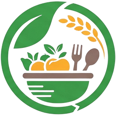

# PsarKasekor (ផ្សារកសិករ) — B2B Agricultural Marketplace

<p align="center">
  
</p>

<p align="center">
  <strong>A direct, transparent digital bridge connecting Cambodian farmers with restaurants and commercial kitchens.</strong>
</p>

<p align="center">
  
  
  
  
  
  
  
  
</p>

---

## 📌 Table of Contents
- [Project Overview](#-project-overview)
- [System Architecture](#-system-architecture)
- [Key Features](#-key-features)
- [Technology Stack](#-technology-stack)
- [Security & Best Practices](#-security--best-practices)
- [Project Structure](#-project-structure)
- [Getting Started](#-getting-started)
  - [Prerequisites](#prerequisites)
  - [Option 1: Quickstart with Docker Compose](#option-1-quickstart-with-docker-compose)
  - [Option 2: Local Development Setup](#option-2-local-development-setup)
- [Environment Configuration](#-environment-configuration)
- [Core API Endpoints](#-core-api-endpoints)
- [License](#-license)

---

## 🚀 Project Overview

Traditional agricultural supply chains in Cambodia often rely on multiple intermediaries, resulting in volatile prices, post-harvest losses, and lower margins for smallholder farmers. 

**PsarKasekor** solves this challenge by enabling restaurants, hotels, and food service businesses to source fresh agricultural produce directly from verified local farmers at transparent wholesale prices:
- **Zero Middleman Markup:** Fair farm-gate income for farmers; lower ingredient costs for restaurants.
- **Harvest Transparency:** Clear insight into harvest dates, GAP/Organic certifications, and farm locations.
- **Commercial-Grade Procurement:** Built-in Minimum Order Quantities (MOQ), bulk order management, real-time messaging, and order tracking.

---

## 🏗️ System Architecture

```
                                    CLIENT LAYER
                ┌──────────────────────────────────────────────────┐
                │          Flutter Cross-Platform Application      │
                │             (Android • iOS • Web)                │
                │    GoRouter Navigation • Riverpod State Mgt      │
                └─────────────────────────┬────────────────────────┘
                                          │  HTTPS / WSS
                                          ▼
                                   API GATEWAY LAYER
                ┌──────────────────────────────────────────────────┐
                │               NestJS REST & Gateway              │
                │    JWT Auth Guards • Role Guards (RBAC)          │
                │    Class-Validator Pipe • Rate Limiting          │
                └─────────────┬──────────────────────┬─────────────┘
                              │                      │
                  Event Bus / │                      │ File Streams
                  WebSockets  │                      ▼
                              ▼               ┌──────────────┐
                       ┌──────────────┐       │ Static Asset │
                       │  Socket.io   │       │ Multer Store │
                       │ (Real-time)  │       │  (/uploads)  │
                       └──────┬───────┘       └──────────────┘
                              │
                              ▼
                      PERSISTENCE LAYER
                ┌─────────────────────────────┐
                │    PostgreSQL Database      │
                │   TypeORM Data Modeling     │
                │ Relational Schemas & Index  │
                └─────────────────────────────┘
```

---

## ✨ Key Features

### 👨‍🌾 For Farmers (Suppliers)
- **Supplier Profile:** Farm branding, business description, location tag, and verification badges.
- **Inventory & Crop Listings:** Publish products with condition tags (*Fresh, Organic, GAP*), bulk quantities, harvest dates, and minimum order requirements (MOQ).
- **Multi-Image Uploads:** Upload multi-angle crop photos with automatic server-side storage and preview.
- **Order Management:** Accept, process, package, dispatch, and track incoming wholesale orders.
- **Direct Chat:** Real-time buyer negotiations and inquiry responses via WebSockets.

### 🍽️ For Restaurants & Buyers
- **B2B Discovery Hub:** 
  - Dynamic personalized greeting with delivery address context.
  - Live Cart count badge and Notifications indicator.
  - Trusted local farmers horizontal carousel linking directly to farm profiles.
- **Advanced Sourcing Engine:**
  - Multi-criteria filter modal: Sort by *Newest Harvest, Price (Low/High), Lowest MOQ*.
  - Quality filters: *Organic / GAP Certified*, *Ready in Stock Only*, *Province of Origin*.
  - Interactive active-filter chips bar with 1-tap removal.
- **Dual-View Showcase:** Switch between **2-Column Grid** for high-density scanning and **1-Column List** for deep product specifications.
- **Wholesale Procurement & Cart:** 1-tap Add to Cart respecting MOQ thresholds, checkout workflow, and live order tracking.
- **Multi-Language Localization:** Full bilingual support for **Khmer (ភាសាខ្មែរ)** and **English**.

---

## 🛠️ Technology Stack

| Layer | Technology | Details |
|---|---|---|
| **Mobile & Frontend** | [Flutter](https://flutter.dev/) (Dart 3) | Cross-platform UI (Android, iOS, Web) |
| **Routing** | [GoRouter](https://pub.dev/packages/go_router) | Declarative routing with splash and deep-link handling |
| **State Management** | [Riverpod](https://pub.dev/packages/flutter_riverpod) | Safe, decoupled reactive state |
| **Backend API** | [NestJS 11](https://nestjs.com/) (Node.js) | Enterprise modular TypeScript framework |
| **Database ORM** | [TypeORM](https://typeorm.io/) | Declarative schema modeling and relation mapping |
| **Database Engine** | [PostgreSQL 17](https://www.postgresql.org/) | ACID-compliant relational storage |
| **Real-time Messaging** | [Socket.io](https://socket.io/) | Low-latency WebSockets for chat and instant notifications |
| **File Handling** | [Multer](https://github.com/expressjs/multer) | Server-side secure file processing for images |
| **Containerization** | [Docker](https://www.docker.com/) & Docker Compose | Standardized multi-container deployment |

---

## 🔒 Security & Best Practices

The platform is designed with defense-in-depth principles to protect transactional data, user accounts, and business identities:

1. **Stateless JWT Authentication:**
   - Cryptographically signed JSON Web Tokens (`Bearer <token>`) with 7-day token expiration.
   - Client-side token validation and graceful session recovery.
2. **Password Cryptography:**
   - Passwords hashed using industry-standard **Bcrypt** with salt rounds before database persistence.
3. **Role-Based Access Control (RBAC):**
   - Strict guards separating `Farmer` operations (e.g. inventory management) from `Restaurant` operations (e.g. cart and purchasing).
4. **Input Validation & Sanitization:**
   - Global NestJS `ValidationPipe` with `whitelist: true` and `transform: true` prevents mass assignment and malicious payload injection.
5. **Secret Isolation:**
   - Sensitive database credentials, JWT secrets, and ports are isolated in `.env` files and strictly excluded from Git tracking via `.gitignore`.
   - Templatized `.env.example` provided for safe environment setup.
6. **Cross-Origin Resource Sharing (CORS):**
   - Configured CORS policies for mobile clients and web endpoints.

---

## 📂 Project Structure

```text
B2B Marketplace/
├── .env.example               # Template environment variables for Docker
├── .gitignore                 # Root gitignore protecting secrets & build outputs
├── docker-compose.yml         # Container orchestration (Postgres, Backend, Frontend)
├── README.md                  # Project documentation
│
├── backend/                   # NestJS REST & WebSocket API
│   ├── .env.example           # Template environment variables for Backend
│   ├── src/
│   │   ├── auth/              # JWT auth, login, registration, guards & strategies
│   │   ├── users/             # User entity, profile service, recommended farmers
│   │   ├── products/          # Produce catalog, multipart image uploads
│   │   ├── cart/              # Buyer wholesale cart & line-item persistence
│   │   ├── order/             # Order placement, status transitions & tracking
│   │   ├── chat/              # WebSocket chat gateway, message persistence
│   │   ├── notification/      # Real-time event notifications & unread tracking
│   │   ├── favorites/         # Buyer wishlist and farm following
│   │   ├── app.module.ts      # Application root module & TypeORM DB connection
│   │   └── main.ts            # Entrypoint, CORS, static uploads serving, pipes
│   ├── uploads/               # Persistent file storage for media assets
│   ├── Dockerfile             # Container definition for backend service
│   └── package.json           # Node dependencies and scripts
│
└── mobile/                    # Flutter Mobile & Web Client
    ├── assets/                # Logos, splash graphics, and branding assets
    ├── lib/
    │   ├── core/              # Constants (ApiConstants), AppLocale, AppRouter
    │   ├── l10n/              # Khmer (km) and English (en) localization arb files
    │   ├── features/
    │   │   ├── auth/          # Splash, language selector, login, registration
    │   │   ├── farmer/        # Farmer dashboard, inventory CRUD, order management
    │   │   ├── restaurant/    # Redesigned buyer home screen, search market, profile
    │   │   ├── product/       # Product details, grid/list cards, favorite services
    │   │   ├── cart/          # B2B cart, MOQ validation, checkout flows
    │   │   ├── order/         # Order tracking, invoice details, order history
    │   │   ├── chat/          # Direct messaging screen & conversation lists
    │   │   └── notification/  # Notification center & badge count hooks
    │   └── main.dart          # Flutter entrypoint with native splash preservation
    └── pubspec.yaml           # Flutter packages, assets, and native splash config
```

---

## 🚦 Getting Started

### Prerequisites
Make sure you have the following installed on your development machine:
- [Git](https://git-scm.com/)
- [Node.js](https://nodejs.org/) (v18 or v20 LTS) & npm
- [Flutter SDK](https://docs.flutter.dev/get-started/install) (v3.24+ recommended)
- [PostgreSQL](https://www.postgresql.org/) (v15+) *or* [Docker Desktop](https://www.docker.com/products/docker-desktop/)

---

### Option 1: Quickstart with Docker Compose

Run the entire stack (Database, Backend API, and Web Client) in containers with a single command:

1. **Clone the repository:**
   ```bash
   git clone https://github.com/your-username/B2B-Marketplace.git
   cd "B2B-Marketplace"
   ```

2. **Configure environment variables:**
   ```bash
   cp .env.example .env
   # Edit .env with your desired secure passwords
   ```

3. **Start all services:**
   ```bash
   docker compose up --build
   ```

4. **Access the services:**
   - **Backend API:** `http://localhost:3000`
   - **PostgreSQL Database:** `localhost:5432`
   - **Web App:** `http://localhost:8080`

---

### Option 2: Local Development Setup

#### 1. Backend Setup (NestJS & PostgreSQL)

```bash
# Navigate to backend directory
cd backend

# Install dependencies
npm install

# Create local environment file from template
cp .env.example .env

# Configure .env with your local PostgreSQL database credentials
# Example:
# DB_HOST=localhost
# DB_PORT=5432
# DB_USERNAME=postgres
# DB_PASSWORD=your_password
# DB_DATABASE=b2bmarketplace
# JWT_SECRET=your_super_secret_key

# Start backend in development watch mode
npm run start:dev
```
The NestJS server will start on `http://localhost:3000`.

#### 2. Mobile / Frontend Setup (Flutter)

```bash
# In a new terminal, navigate to mobile directory
cd mobile

# Fetch Flutter dependencies
flutter pub get

# (Optional) Verify that all Dart code is clean
flutter analyze

# Run on an Android emulator or connected device
flutter run

# Or run in Google Chrome
flutter run -d chrome
```

> **Tip for Mobile Devices/Emulators:**  
> If testing on a physical phone or Android Emulator, ensure [mobile/lib/core/constants/api_constants.dart](file:///d:/ITC/Intern/B2B%20Marketplace/mobile/lib/core/constants/api_constants.dart) points to your computer's local network IP address (e.g. `http://192.168.x.x:3000`) instead of `localhost`.

---

## ⚙️ Environment Configuration

Never commit real secrets or production credentials to source control. Below is a reference of required environment keys:

| Variable | Description | Default / Example |
|---|---|---|
| `PORT` | Port the NestJS HTTP server binds to | `3000` |
| `NODE_ENV` | Application environment | `development` / `production` |
| `DB_HOST` | Hostname of the PostgreSQL database | `localhost` (or `postgres` in Docker) |
| `DB_PORT` | PostgreSQL port | `5432` |
| `DB_USERNAME` | Database username | `postgres` |
| `DB_PASSWORD` | Database password | *Keep confidential* |
| `DB_DATABASE` | Database name | `b2bmarketplace` |
| `JWT_SECRET` | Secret key used to sign authentication tokens | *Generate strong 256-bit random string* |
| `JWT_EXPIRATION`| Lifetime of issued JWT tokens | `7d` |

---

## 📡 Core API Endpoints

All protected endpoints require an `Authorization: Bearer <token>` header.

### 🔐 Authentication & Profile
- `POST /auth/register` — Register as Farmer or Restaurant
- `POST /auth/login` — Authenticate and receive JWT access token
- `GET /users/profile` — Retrieve current authenticated user profile
- `GET /users/recommended/farmers` — Retrieve top verified agricultural producers
- `GET /users/:id` — Public profile and farm details of a user

### 🌾 Products & Inventory
- `GET /products` — Browse all products with category and seller metadata
- `GET /products/my` — Farmer's own product catalog
- `GET /products/:id` — Detailed view of a single produce item
- `POST /products` — *(Farmer only)* Publish new crop listing with multi-image upload
- `PATCH /products/:id` — *(Farmer only)* Update pricing, stock quantity, or MOQ

### 🛒 Cart & Orders
- `GET /cart` — View current buyer cart contents
- `POST /cart/items` — Add product to cart with MOQ validation
- `DELETE /cart/items/:id` — Remove item from cart
- `POST /orders` — Submit wholesale purchase order
- `GET /orders/restaurant` — Buyer's order history and statuses
- `GET /orders/farmer` — Supplier's incoming orders dashboard
- `PATCH /orders/:id/status` — Update fulfillment state (*Pending ➔ Confirmed ➔ Dispatched ➔ Delivered*)

### 💬 Real-Time Chat & Favorites
- `GET /favorites` — Buyer's saved products
- `POST /favorites/toggle/:productId` — Toggle product wishlist status
- `GET /notifications/unread-count` — Count of unread notifications
- `WS /socket.io` — Real-time event gateway for direct chat and status updates

---

## 📄 License

This software is developed as part of an engineering internship project. Distributed under the MIT License. See `LICENSE` for more information.
