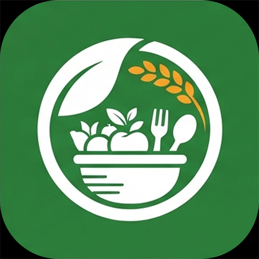

# FarmLink — B2B Agricultural Marketplace

<p align="center">
  
</p>

<p align="center">
  <strong>A direct, transparent digital bridge connecting Cambodian farmers with restaurants and commercial kitchens.</strong>
</p>

<p align="center">
  
  
  
  
  
  
  
  
  
</p>

---

## 📌 Table of Contents
- [Project Overview](#-project-overview)
- [System Architecture](#-system-architecture)
- [Performance & Optimization Highlights](#-performance--optimization-highlights)
- [Key Features](#-key-features)
- [Technology Stack](#-technology-stack)
- [Security & Best Practices](#-security--best-practices)
- [Project Structure](#-project-structure)
- [Mobile Screen & Route Map](#-mobile-screen--route-map)
- [Getting Started](#-getting-started)
  - [Prerequisites](#prerequisites)
  - [Option 1: Quickstart with Docker Compose](#option-1-quickstart-with-docker-compose)
  - [Option 2: Local Development Setup](#option-2-local-development-setup)
  - [Mobile App Configuration & Network Targeting](#mobile-app-configuration--network-targeting)
- [Environment Configuration](#-environment-configuration)
- [Core API & WebSocket Reference](#-core-api--websocket-reference)
- [License](#-license)

---

## 🚀 Project Overview

Traditional agricultural supply chains in Cambodia often rely on multiple intermediaries, resulting in volatile prices, post-harvest losses, and lower margins for smallholder farmers. 

**FarmLink** solves this challenge by enabling restaurants, hotels, and food service businesses to source fresh agricultural produce directly from verified local farmers at transparent wholesale prices:
- **Zero Middleman Markup:** Fair farm-gate income for farmers; lower ingredient costs for restaurants.
- **Harvest Transparency:** Clear insight into harvest dates, GAP/Organic certifications, and farm locations.
- **Commercial-Grade Procurement:** Built-in Minimum Order Quantities (MOQ), bulk order management, real-time messaging, and order tracking.
- **Real-Time Synchronous Ecosystem:** Instant notifications, live chat with image attachments, and immediate status synchronization powered by WebSockets and an internal event bus.

---

## 🏗️ System Architecture

```
                                    CLIENT LAYER
                ┌──────────────────────────────────────────────────┐
                │          Flutter Cross-Platform Application      │
                │             (Android • iOS • Web)                │
                │     GoRouter Navigation • Riverpod State Mgt     │
                │      Dio HTTP Client • Socket.io Client Engine   │
                └─────────────────────────┬────────────────────────┘
                                          │  HTTPS / WSS
                                          ▼
                                   API GATEWAY LAYER
                ┌──────────────────────────────────────────────────┐
                │             NestJS REST & WebSocket API          │
                │                 (Listening on Port 3001)         │
                │   JWT Auth Guards • Role Guards (Farmer/Buyer)   │
                │   Class-Validator Pipe • Rate Limiting & Multer  │
                └───────────────┬──────────────────┬───────────────┘
                                │                  │
         Internal In-Memory     │                  │ Static Asset Serving
         Event Emitter Bus      │                  ▼
        ┌───────────────────────┴────────┐  ┌──────────────┐
        │ @nestjs/event-emitter          │  │ Multer Store │
        │ • order.created ➔ notification │  │  (/uploads)  │
        │ • chat.message.created         │  └──────────────┘
        │ • count_updated                │
        └───────────────┬────────────────┘
                        │
                        ▼
                 REAL-TIME LAYER
        ┌────────────────────────────────┐
        │ Socket.io Gateway              │
        │ • User rooms: user_{userId}    │
        │ • Conversation rooms           │
        │ • Live push & badge sync       │
        └───────────────┬────────────────┘
                        │
                        ▼
                PERSISTENCE LAYER
        ┌────────────────────────────────┐
        │      PostgreSQL 17 Engine      │
        │    TypeORM Relational Models   │
        │   B-Tree Optimized Indexing    │
        └────────────────────────────────┘
```

---

## ⚡ Performance & Optimization Highlights

Recent architectural improvements ensure enterprise responsiveness and database efficiency:

1. **Strategic Database Indexing (B-Tree):**
   - **Users:** Composite indexes on `role` and `isActive` for instantaneous query filtering of active farmers and restaurants.
   - **Products:** Multi-column indexing on `farmerId`, `category`, `condition`, `location`, and `price` to accelerate faceted search and filter queries.
   - **Orders & Items:** Foreign key indexes on `restaurantId`, `farmerId`, `status`, and `order_items.orderId` for rapid order history retrieval and joins.
   - **Favorites & Social:** Composite unique indexes on `(userId, productId)` to achieve sub-millisecond lookup and toggle performance.
   - **Notifications:** Indexed on `userId` and `isRead` for fast unread count aggregation.

2. **Decoupled Event-Driven Notifications:**
   - Order creation and status transitions emit asynchronous internal events using `@nestjs/event-emitter`.
   - Notification generation, database writes, and socket broadcasts execute out-of-band without blocking the HTTP request-response lifecycle.

3. **Client-Side UX & Network Optimization:**
   - **Debounced Search:** Sourcing engine debounce buffers keystrokes before hitting backend search APIs.
   - **Silent Conversation Sync:** Chat updates sync in the background without causing full-screen reload flickers.
   - **Paginated Lazy Loading:** Product catalogs, chat message history, and notification feeds leverage limit/cursor pagination to conserve device memory.

---

## ✨ Key Features

### 👨‍🌾 For Farmers (Suppliers)
- **Supplier Profile:** Farm branding, business description, location tags, cover and avatar photo uploads.
- **Inventory & Crop Listings:** Publish products with condition tags (*Fresh, Organic, GAP*), bulk quantities, harvest dates, and minimum order requirements (MOQ).
- **Multi-Image Uploads:** Upload multi-angle crop photos (up to 5 photos per product, 5MB max) with server-side validation and static serving.
- **Order Management Dashboard:** Accept, process, package, dispatch, and complete incoming wholesale orders.
- **Direct Real-Time Chat:** Live buyer negotiations, real-time message exchange, and photo attachments via WebSockets.

### 🍽️ For Restaurants & Buyers
- **B2B Discovery Hub:** 
  - Dynamic personalized greeting with delivery address context.
  - Live Cart count badge and Notifications indicator.
  - Trusted local farmers horizontal carousel linking directly to farm profiles.
- **Advanced Sourcing Engine:**
  - Multi-criteria filter modal: Sort by *Newest Harvest, Price (Low/High), Lowest MOQ*.
  - Quality filters: *Organic / GAP Certified*, *Ready in Stock Only*, *Province of Origin*.
  - Interactive active-filter chips bar with 1-tap removal.
- **Dual-View Showcase:** Switch between **2-Column Grid** for high-density scanning and **1-Column List** for detailed product specifications.
- **Wholesale Procurement & Cart:** 1-tap Add to Cart respecting MOQ thresholds, checkout workflow (`/orders/checkout`), and live order tracking.
- **Favorites & Saved Items:** Bookmark preferred products or farms for rapid re-ordering.
- **Multi-Language Localization:** Full bilingual support for **Khmer (ភាសាខ្មែរ)** and **English**.

---

## 🛠️ Technology Stack

| Layer | Technology | Details |
|---|---|---|
| **Mobile & Frontend** | [Flutter 3.x](https://flutter.dev/) (Dart 3) | Cross-platform UI (Android, iOS, Web) |
| **Routing** | [GoRouter 16](https://pub.dev/packages/go_router) | Declarative routing with guard redirection and deep-link handling |
| **State Management** | [Riverpod 2.6](https://pub.dev/packages/flutter_riverpod) | Decoupled reactive state management |
| **HTTP & Networking** | [Dio 5.9](https://pub.dev/packages/dio) | Interceptor-driven HTTP requests with token attachment |
| **Backend API** | [NestJS 11](https://nestjs.com/) (Node.js) | Modular TypeScript framework with `@nestjs/event-emitter` |
| **Database ORM** | [TypeORM 1.x](https://typeorm.io/) | Declarative schema modeling, migrations, and relation mapping |
| **Database Engine** | [PostgreSQL 17](https://www.postgresql.org/) | ACID-compliant relational database with B-Tree indexes |
| **Real-time Messaging** | [Socket.io 4.x](https://socket.io/) | Bidirectional WebSockets for chat and instant notifications |
| **File Handling** | [Multer](https://github.com/expressjs/multer) | Server-side file processing for products, avatars, covers, and chat attachments |
| **Security & Auth** | Passport JWT & Bcrypt | Stateless cryptographic tokens with HTTP-only cookies and Bcrypt hashing |
| **Containerization** | [Docker](https://www.docker.com/) & Docker Compose | Multi-container orchestration (PostgreSQL + NestJS API) |

---

## 🔒 Security & Best Practices

1. **Stateless JWT Authentication & Refresh Cookies:**
   - Cryptographically signed JSON Web Tokens (`Bearer <token>`) with 7-day expiration.
   - Dual transport: Mobile clients use `Bearer` tokens via secure storage; web clients support `httpOnly` secure cookies.
2. **Password Cryptography & OTP Verification:**
   - Passwords hashed using industry-standard **Bcrypt** with salt rounds before database persistence.
   - Two-step user registration with OTP phone/email verification (`/auth/verify-otp`).
3. **Role-Based Access Control (RBAC):**
   - Strict guards separating `Farmer` operations (e.g. inventory CRUD, farmer orders) from `Restaurant` operations (e.g. cart, checkout).
4. **Input Validation & Sanitization:**
   - Global NestJS `ValidationPipe` with `whitelist: true` and `transform: true` prevents mass assignment and malicious payload injection.
5. **Secret Isolation:**
   - All database credentials, JWT secrets, and port bindings are isolated in `.env` files and excluded from Git tracking via `.gitignore`.
6. **Upload Constraints:**
   - Strict file filters limit uploaded files to valid MIME image types (`image/*`) with individual file size limits (5MB - 10MB).

---

## 📂 Project Structure

```text
B2B Marketplace/
├── .env                       # Active root environment secrets (excluded from git)
├── .env.example               # Template environment variables for Docker Compose
├── .gitignore                 # Root gitignore protecting secrets & build artifacts
├── docker-compose.yml         # Container orchestration (Postgres 17, NestJS Backend)
├── README.md                  # Comprehensive project documentation
│
├── backend/                   # NestJS REST & WebSocket API
│   ├── .env.example           # Template environment variables for local backend
│   ├── src/
│   │   ├── auth/              # JWT auth, register, OTP verification, login, reset password
│   │   ├── users/             # User entity, profile service, avatar/cover uploads, recommended farmers
│   │   ├── products/          # Produce catalog, faceted search, multipart uploads
│   │   ├── cart/              # Buyer wholesale cart & line-item persistence
│   │   ├── order/             # Checkout, order status transitions, event dispatches
│   │   ├── chat/              # WebSocket gateway, message persistence, attachment uploads
│   │   ├── notification/      # Push notifications, unread count tracking, event listeners
│   │   ├── favorites/         # Buyer wishlist and farm bookmarking
│   │   ├── app.module.ts      # Application root module & TypeORM DB connection
│   │   └── main.ts            # Entrypoint (Port 3001), CORS, static uploads serving, pipes
│   ├── uploads/               # Persistent media asset directory (/products, /avatar, /cover, /chat)
│   ├── Dockerfile             # Multi-stage production container build for backend
│   └── package.json           # Node dependencies and scripts
│
└── mobile/                    # Flutter Mobile & Web Client
    ├── assets/                # Logos (logo01.png), splash graphics, and branding assets
    ├── lib/
    │   ├── core/
    │   │   ├── constants/     # ApiConstants (Port 3001, LAN fallback, image URLs)
    │   │   ├── routing/       # AppRouter, AppRoutes, and RouteArgs
    │   │   ├── search/        # Search debounce logic and query builders
    │   │   ├── services/      # Token storage, secure storage, and network providers
    │   │   └── app_locale.dart# Locale switcher provider
    │   ├── l10n/              # Khmer (km) and English (en) localization arb files
    │   ├── features/
    │   │   ├── auth/          # Splash, language selector, login, registration, OTP verify
    │   │   ├── farmer/        # Farmer dashboard, inventory CRUD, incoming order fulfillment
    │   │   ├── restaurant/    # Buyer home screen, discovery market, supplier profile
    │   │   ├── product/       # Product details, grid/list cards, favorite services
    │   │   ├── cart/          # B2B cart, MOQ validation, checkout flows
    │   │   ├── order/         # Order tracking, invoice details, order history
    │   │   ├── chat/          # Direct messaging screen, attachments, conversation list
    │   │   ├── notification/  # Notification center & badge count hooks
    │   │   └── profile/       # Profile management, farm cover/avatar uploads, settings
    │   └── main.dart          # Flutter entrypoint with native splash preservation
    └── pubspec.yaml           # Flutter packages, assets, and native splash config
```

---

## 🗺️ Mobile Screen & Route Map

All screen navigations are centrally declared via [mobile/lib/core/routing/app_routes.dart](file:///d:/ITC/Intern/B2B%20Marketplace/mobile/lib/core/routing/app_routes.dart):

| Domain | Route Path | Description |
|---|---|---|
| **Onboarding** | `/splash` | Initial loading and authentication guard check |
| | `/language` | Language selection (*Khmer* vs *English*) |
| | `/get-started` | Welcome and platform introduction |
| | `/role-selection` | Select user role (*Farmer* vs *Restaurant*) |
| **Auth** | `/login` | Account credential login |
| | `/sign-up` | Account registration form |
| | `/verify-phone` | Phone / OTP verification screen |
| | `/forgot-password` | Request password reset verification code |
| | `/reset-password` | Set new account password |
| | `/setup-profile` | Initial profile and farm/restaurant identity setup |
| **Farmer** | `/farmer` | Supplier main dashboard and revenue metrics |
| | `/farmer/orders` | Incoming wholesale purchase orders |
| | `/farmer/orders/detail`| Individual order fulfillment and status controls |
| | `/farmer/inventory` | Crop catalog management |
| | `/farmer/inventory/add`| Publish new product with multi-image picker |
| | `/farmer/inventory/edit`| Update crop stock, price, or MOQ |
| | `/farmer/inventory/detail`| Supplier view of product analytics |
| | `/farmer/chat` | Farmer active conversations list |
| | `/farmer/profile` | Public farm page preview and verification details |
| | `/farmer/settings` | Account configurations and security |
| **Restaurant** | `/restaurant` | Buyer home screen with recommended farmers and products |
| | `/restaurant/search` | Search engine with category chips and filter modal |
| | `/restaurant/cart` | Wholesale procurement cart with MOQ validation |
| | `/restaurant/checkout`| Shipping address and order confirmation |
| | `/restaurant/payment-method`| Payment terms selection |
| | `/restaurant/order-success`| Order placement confirmation screen |
| | `/restaurant/orders` | Buyer order history and status pills |
| | `/restaurant/orders/tracking`| Real-time order progress timeline |
| | `/restaurant/favorites`| Wishlist and saved farms |
| | `/restaurant/farmer-profile`| Verified farm detail view with crop catalog |
| | `/restaurant/chat` | Buyer active conversations list |
| | `/restaurant/profile` | Restaurant business profile & delivery address |
| | `/restaurant/settings`| Notifications and language settings |
| **Shared** | `/product/detail` | Comprehensive produce details with MOQ selector |
| | `/chat/conversation` | 1-on-1 WebSocket chat screen with photo upload |
| | `/notifications` | Live notification center with mark-all-as-read |

---

## 🚦 Getting Started

### Prerequisites
Make sure you have the following installed on your development machine:
- [Git](https://git-scm.com/)
- [Node.js](https://nodejs.org/) (v18 or v20 LTS) & npm
- [Flutter SDK](https://docs.flutter.dev/get-started/install) (v3.24+ recommended)
- [PostgreSQL](https://www.postgresql.org/) (v15+) *or* [Docker Desktop](https://www.docker.com/products/docker-desktop/)

---

### Option 1: Quickstart with Docker Compose

Run PostgreSQL 17 and the NestJS backend service inside Docker containers:

1. **Clone the repository:**
   ```bash
   git clone https://github.com/your-username/B2B-Marketplace.git
   cd "B2B-Marketplace"
   ```

2. **Configure environment variables:**
   ```bash
   cp .env.example .env
   # Ensure POSTGRES_PASSWORD and JWT_SECRET are set securely
   ```

3. **Start backend and database services:**
   ```bash
   docker compose up --build
   ```

4. **Service Endpoints:**
   - **Backend API:** `http://localhost:3001`
   - **PostgreSQL Database:** `localhost:5432`

---

### Option 2: Local Development Setup

#### 1. Backend Setup (NestJS & PostgreSQL)

```bash
# Navigate to backend directory
cd backend

# Install dependencies
npm install

# Create local environment configuration
cp .env.example .env

# Edit .env with your local PostgreSQL database credentials
# Note: Ensure DB_PORT is 5432 and PORT is 3001

# Start backend in development watch mode
npm run start:dev
```
The NestJS server will start on `http://localhost:3001`.

#### 2. Mobile Client Setup (Flutter)

```bash
# In a new terminal, navigate to mobile directory
cd mobile

# Fetch Flutter dependencies
flutter pub get

# (Optional) Verify Dart code health
flutter analyze

# Run on an Android emulator or connected device
flutter run

# Or run in Google Chrome for Web testing
flutter run -d chrome
```

---

### Mobile App Configuration & Network Targeting

By default, the Flutter app resolves backend traffic according to runtime platform:
- **Web / Desktop:** Connects directly to `http://localhost:3001`.
- **Physical Android / iOS Devices & Emulators:**
  The app uses the host LAN IP configured in [mobile/lib/core/constants/api_constants.dart](file:///d:/ITC/Intern/B2B%20Marketplace/mobile/lib/core/constants/api_constants.dart).

To compile or run against a custom backend host or staging server without modifying source files, supply `--dart-define`:
```bash
flutter run --dart-define=API_BASE_URL=http://192.168.1.100:3001
```

For release APK generation:
```bash
flutter build apk --release --dart-define=API_BASE_URL=https://api.yourdomain.com
```

---

## ⚙️ Environment Configuration

Below is the reference of environment variables utilized across local development and Docker:

| Variable | Description | Default / Example |
|---|---|---|
| `PORT` | Port the NestJS HTTP & WebSocket server binds to | `3001` (Docker maps host `3001:3000`) |
| `NODE_ENV` | Application environment (`development` / `production`) | `development` |
| `DB_HOST` | Hostname of the PostgreSQL database | `localhost` (or `postgres` in Docker) |
| `DB_PORT` | PostgreSQL port | `5432` |
| `DB_USERNAME` | Database username | `postgres` |
| `DB_PASSWORD` | Database password | *Keep confidential* |
| `DB_DATABASE` | Database name | `b2bmarketplace` |
| `DB_SYNCHRONIZE` | Auto-synchronize TypeORM entities with DB schema | `true` (dev) / `false` (prod) |
| `JWT_SECRET` | Secret key used to sign and verify authentication tokens | *Generate strong 256-bit string* |
| `JWT_EXPIRATION`| Lifetime of issued JWT tokens | `7d` |
| `CORS_ORIGIN` | Allowed CORS origins (comma-separated or `*`) | `*` |

---

## 📡 Core API & WebSocket Reference

All protected endpoints require an `Authorization: Bearer <token>` header (or valid authentication cookie).

### 🔐 Authentication
| Method | Endpoint | Description |
|---|---|---|
| `POST` | `/auth/register` | Register a new user (`farmer` or `restaurant`) |
| `POST` | `/auth/verify-otp` | Verify registration with OTP code |
| `POST` | `/auth/login` | Authenticate user, return JWT and set auth cookie |
| `POST` | `/auth/logout` | Invalidate cookie and logout session |
| `POST` | `/auth/forgot-password` | Request password reset code via phone/email |
| `POST` | `/auth/reset-password` | Reset password using verified reset token |

### 👤 Users & Profiles
| Method | Endpoint | Description |
|---|---|---|
| `GET` | `/users/profile` | Retrieve profile of authenticated user |
| `PATCH`| `/users/profile` | Update user/business profile information |
| `POST` | `/users/profile/avatar` | Upload and set profile avatar photo |
| `POST` | `/users/profile/cover` | Upload and set farm/restaurant cover banner |
| `GET` | `/users/recommended/farmers` | Retrieve curated list of verified farmers |
| `GET` | `/users/:id` | View public profile of a user or farm |

### 🌾 Products & Inventory
| Method | Endpoint | Description |
|---|---|---|
| `GET` | `/products` | Browse catalog with filters (`page`, `limit`, `search`, `category`, `condition`, `location`, `maxMoq`, `inStockOnly`, `sortBy`, `farmerId`) |
| `GET` | `/products/my` | Retrieve authenticated farmer's own listings |
| `GET` | `/products/:id` | Detailed view of a single produce item |
| `POST` | `/products` | *(Farmer only)* Create listing with multi-image upload (up to 5 photos) |
| `PATCH`| `/products/:id` | *(Farmer only)* Update listing pricing, stock, MOQ, or images |
| `DELETE`| `/products/:id` | *(Farmer only)* Delete product listing |

### 🛒 Wholesale Cart
| Method | Endpoint | Description |
|---|---|---|
| `GET` | `/cart` | Retrieve current buyer wholesale cart contents |
| `POST` | `/cart/items` | Add product to cart with MOQ threshold validation |
| `PATCH`| `/cart/items/:productId` | Update item quantity in cart |
| `DELETE`| `/cart/items/:productId` | Remove individual item from cart |
| `DELETE`| `/cart` | Empty and clear the entire cart |

### 📦 Orders & Fulfillment
| Method | Endpoint | Description |
|---|---|---|
| `POST` | `/orders/checkout` | Submit cart contents as a wholesale purchase order |
| `GET` | `/orders` | Retrieve buyer's order history and statuses |
| `GET` | `/orders/farmer` | *(Farmer only)* Retrieve incoming supplier orders |
| `GET` | `/orders/:id` | View detailed invoice and status breakdown of an order |
| `PATCH`| `/orders/:id/status` | Update fulfillment status (`Pending` ➔ `Confirmed` ➔ `Dispatched` ➔ `Delivered` ➔ `Cancelled`) |

### ⭐ Favorites & Wishlists
| Method | Endpoint | Description |
|---|---|---|
| `GET` | `/favorites` | Retrieve full product details of saved favorites |
| `GET` | `/favorites/ids` | Retrieve list of favorited product IDs |
| `GET` | `/favorites/count` | Total count of favorited products |
| `GET` | `/favorites/:productId/check` | Check if a specific product is favorited |
| `POST` | `/favorites/:productId/toggle`| Toggle product wishlist bookmark |

### 💬 Real-Time Chat & File Attachments
| Method | Endpoint | Description |
|---|---|---|
| `POST` | `/chat/upload` | Upload image attachment for chat messages (10MB max) |
| `POST` | `/chat/conversations` | Create or retrieve an existing 1-on-1 conversation |
| `GET` | `/chat/conversations` | List authenticated user's active conversations |
| `GET` | `/chat/conversations/:id` | Retrieve conversation metadata and participants |
| `GET` | `/chat/conversations/:id/messages` | Paginated message history (`limit`, cursor `before`) |
| `POST` | `/chat/conversations/:id/messages` | Send a text or media message to a conversation |
| `PATCH`| `/chat/conversations/:id/read` | Mark all unread messages in conversation as read |

### 🔔 Notifications
| Method | Endpoint | Description |
|---|---|---|
| `GET` | `/notifications` | List user notifications with pagination (`limit`, `offset`) |
| `GET` | `/notifications/unread-count` | Retrieve badge count of unread notifications |
| `PATCH`| `/notifications/:id/read` | Mark single notification as read |
| `PATCH`| `/notifications/read-all` | Mark all user notifications as read |
| `DELETE`| `/notifications/:id` | Delete specific notification |
| `DELETE`| `/notifications` | Clear all notifications |

### ⚡ WebSocket Events (`WS /socket.io`)
- **Connection & Status:** `connected`, `user_status_changed`
- **Rooms:** Clients join user channel `user_{userId}` and conversation channel `conv_{conversationId}`.
- **Messaging:** `message_created`, `messages_read`, `user_typing`, `user_stop_typing`
- **Notifications:** `notification_created`, `notification_read`, `notification_read_all`, `notification_count_updated`

---

## 📄 License

This software is developed as part of an engineering internship project. Distributed under the MIT License. See `LICENSE` for more information.
